# AWS Resiliency Plugin

An MCP plugin that configures 6 official AWS MCP servers from [`awslabs/mcp`](https://github.com/awslabs/mcp) for resiliency-focused architecture reviews. Works with Claude Code, Cursor, Windsurf, Kiro, and any MCP-compatible editor.

**Standalone package** — includes both the resiliency skill (expertise brain) and MCP server configuration (the tools). Everything you need in one repo.



---

## What's Inside

### Resiliency Skill (`skills/`)

The skill gives your AI agent deep AWS resiliency expertise:

| File | What It Provides |
|---|---|
| `skills/SKILL.md` | Core skill — failure-mode-first architect persona, two-layer review model (IaC + application code), 7 resiliency domains, structured output format |
| `skills/references/service-failure-modes.md` | Exact timeouts, quota limits, propagation windows per AWS service (RDS failover: 60-120s, Lambda cold starts, SQS visibility timeout edge cases, etc.) |
| `skills/references/well-architected-reliability.md` | Full REL 1-12 pillar questions mapped to resiliency best practices |
| `skills/references/dr-patterns-and-runbooks.md` | DR pattern templates (backup/restore through active-active), game day exercise templates, ORR checklist |
| `skills/scripts/resiliency-review-template.md` | Structured output template for formal review deliverables |

### MCP Servers (`mcp.json`)

6 official AWS MCP servers that give your AI agent real tools:

| MCP Server | Source | What It Adds to Resiliency Reviews |
|---|---|---|
| **AWS IaC** | `awslabs.aws-iac-mcp-server` | CloudFormation validation via cfn-lint, compliance checking via cfn-guard, CDK best practices, deployment troubleshooting (30+ failure patterns) |
| **AWS Terraform** | `awslabs.terraform-mcp-server` | Terraform best practices, Checkov security scanning, Well-Architected guidance for Terraform configs |
| **AWS Knowledge** | `awslabs.aws-knowledge-mcp-server` | Up-to-date AWS documentation, Well-Architected materials, troubleshooting guides, regional availability |
| **Amazon CloudWatch** | `awslabs.cloudwatch-mcp-server` | Live metrics, alarm status/history, CloudWatch Logs Insights queries, trend detection, alarm recommendations |
| **CloudWatch App Signals** | `awslabs.cloudwatch-applicationsignals-mcp-server` | Service health, SLO compliance tracking, distributed tracing, code-level latency analysis |
| **AWS Documentation** | `awslabs.aws-documentation-mcp-server` | Direct AWS documentation page lookup and search across all services |

---

## How They Work Together

```
┌─────────────────────────────────────────────────────┐
│  skills/SKILL.md + references                       │
│  Resiliency expertise loaded as skill context       │
│  "What to look for, failure modes, blast radius"    │
└───────────────────────┬─────────────────────────────┘
                        │ loaded as skill context
                        ▼
┌─────────────────────────────────────────────────────┐
│  Claude Code / Cursor / Kiro (host AI)              │
│  Combines skill knowledge + MCP tool results        │
└───────────────────────┬─────────────────────────────┘
                        │ calls tools from
                        ▼
┌─────────────────────────────────────────────────────┐
│  mcp.json → 6 Official AWS MCP Servers              │
│                                                     │
│  aws-iac             → CFN lint, cfn-guard, CDK     │
│  aws-terraform       → Checkov, WA guidance         │
│  aws-knowledge       → WA docs, best practices      │
│  aws-cloudwatch      → Alarms, logs, metrics        │
│  aws-cloudwatch-signals → SLOs, tracing             │
│  aws-docs            → Service documentation        │
└─────────────────────────────────────────────────────┘
```

**Zero custom code. Zero API cost. Maintained by AWS.**

---

## Who Is This For

| Role | How This Helps |
|---|---|
| **Cloud Engineers** | Get line-level findings on your IaC and application code with corrected code examples |
| **SREs** | Validate failure modes, blast radius, and recovery objectives against your actual infrastructure |
| **Platform Engineers** | Enforce resiliency standards across teams with cfn-guard compliance rules and Checkov scans |
| **Cloud Architects** | Run Well-Architected Reliability pillar reviews with specific, quantified findings |

---

## Prerequisites

- Python 3.10+ with **uv** installed ([install uv](https://docs.astral.sh/uv/getting-started/installation/)) — the AWS MCP servers run via `uvx`
- AWS credentials configured (`aws configure` or environment variables) — required for CloudWatch and live account access

---

## Installation

### Claude Code

**Step 1: Install the skill**

```bash
git clone https://github.com/nirmal84/aws-resiliency-plugin.git
cp -r aws-resiliency-plugin/skills ~/.claude/skills/aws-resiliency
```

**Step 2: Add the MCP servers**

```bash
claude mcp add aws-iac -- uvx awslabs.aws-iac-mcp-server@latest
claude mcp add aws-terraform -- uvx awslabs.terraform-mcp-server@latest
claude mcp add aws-knowledge -- uvx awslabs.aws-knowledge-mcp-server@latest
claude mcp add aws-cloudwatch -- uvx awslabs.cloudwatch-mcp-server@latest
claude mcp add aws-cloudwatch-signals -- uvx awslabs.cloudwatch-applicationsignals-mcp-server@latest
claude mcp add aws-docs -- uvx awslabs.aws-documentation-mcp-server@latest
```

### Cursor / Windsurf / Kiro / Other MCP Editors

**Step 1: Install the skill**

Copy the `skills/` directory to your editor's skill location (varies by editor).

**Step 2: Add the MCP servers**

Copy the contents of [`mcp.json`](mcp.json) into your editor's MCP server configuration file.

---

## What Each Server Does in a Review

### AWS IaC — Validates your CloudFormation/CDK

When you share a CloudFormation template or CDK code:
- **cfn-lint** catches misconfigurations (missing `MultiAZ`, invalid properties, deprecated resources)
- **cfn-guard** enforces compliance rules ("every RDS must have `MultiAZ: true`")
- **CDK best practices** recommends L2/L3 constructs that encode resiliency by default
- **Deployment troubleshooting** diagnoses why stack rollbacks happened

### AWS Terraform — Validates your Terraform

When you share `.tf` files:
- **Checkov** scans for security and resiliency misconfigurations
- **Well-Architected guidance** maps Terraform resources to AWS best practices
- **terraform validate/plan** catches issues before deployment

### AWS Knowledge — Well-Architected expertise

When the skill needs to reference AWS best practices:
- Searches the full AWS documentation corpus
- Returns latest Well-Architected Reliability pillar content
- Checks regional availability of services in DR regions

### Amazon CloudWatch — Live observability data

When reviewing a running workload:
- Pulls actual metrics (CPU, latency, error rates)
- Checks if critical alarms exist and are correctly configured
- Runs CloudWatch Logs Insights queries against real logs
- Detects trends approaching thresholds

### CloudWatch Application Signals — SLO and tracing

When assessing application health:
- Checks if SLOs are being met (availability, latency targets)
- Traces requests across services to find failure points
- Identifies code-level latency bottlenecks

### AWS Documentation — Direct doc lookup

When the skill references a specific service behaviour:
- Fetches the actual AWS documentation page
- Confirms current failover timing, limits, and quotas

---

## Skill Coverage

The resiliency skill reviews across **7 domains**, each with both IaC and application code checks:

| Domain | Services Covered | Example Findings |
|---|---|---|
| **Compute** | EC2, ECS, Lambda | Single instance (no ASG), Lambda missing DLQ, ECS `desiredCount: 1` |
| **Data** | RDS, Aurora, DynamoDB, ElastiCache | `MultiAZ: false`, missing PITR, connection pool exhaustion on failover |
| **Networking** | VPC, Route53, CloudFront, ALB/NLB | Single NAT Gateway, missing health checks, high DNS TTL |
| **Storage** | S3, EBS, EFS | Missing versioning, no snapshot schedule, burst credit exhaustion |
| **Messaging** | SQS, SNS, EventBridge | Missing DLQ, visibility timeout < processing time, no retry policy |
| **Observability** | CloudWatch, X-Ray | Missing alarms, `TreatMissingData: missing`, no business metrics |
| **Multi-Region & DR** | Global Tables, Aurora Global, Route53 ARC | No DR pattern defined, hardcoded regions, manual runbooks |

### Two-Layer Review Model

The skill always reviews **both layers** — because most production incidents live in the gap between them:

- **Layer 1: IaC Review** — What the infrastructure *is* (topology, redundancy, failover config)
- **Layer 2: Application Code Review** — How the application *behaves* under failure (retry logic, timeouts, circuit breakers)

*Example: A perfectly configured Multi-AZ RDS instance still causes a 2-minute outage if the application doesn't handle the 60-120 second DNS failover window.*

---

## File Structure

```
aws-resiliency-plugin/
├── mcp.json                                          # MCP server configuration (6 servers)
├── skills/
│   ├── SKILL.md                                      # Core resiliency skill
│   ├── references/
│   │   ├── service-failure-modes.md                  # Failure modes per AWS service
│   │   ├── well-architected-reliability.md           # REL 1-12 pillar mapping
│   │   └── dr-patterns-and-runbooks.md               # DR patterns, game day, ORR
│   └── scripts/
│       └── resiliency-review-template.md             # Output template for reviews
├── demo.svg                                          # Animated demo
├── README.md                                         # This file
├── CONTRIBUTORS.md                                   # Contributors
├── LICENSE                                           # MIT-0 (MIT No Attribution)
└── .gitignore
```

---

## Related

- **[awslabs/mcp](https://github.com/awslabs/mcp)** — Official AWS MCP servers (source of all 6 servers in this plugin)

---

## Author

**Nirmal Rajan** — [@nirmal84](https://github.com/nirmal84)
